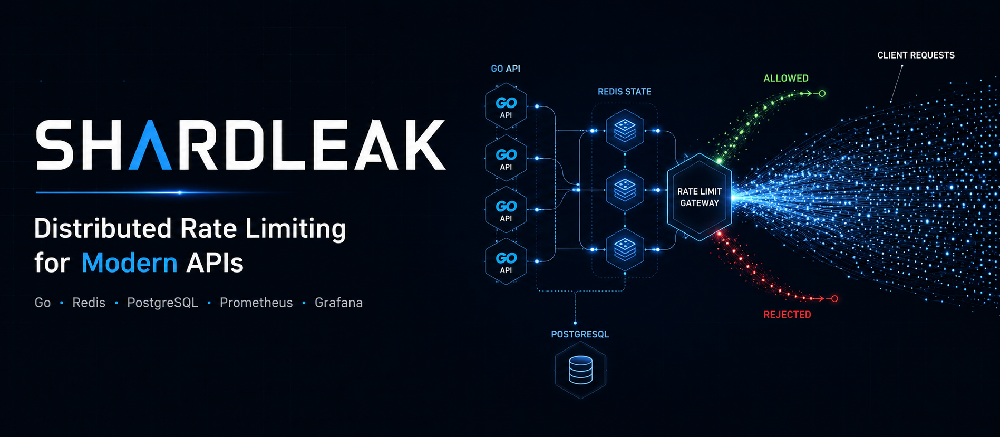
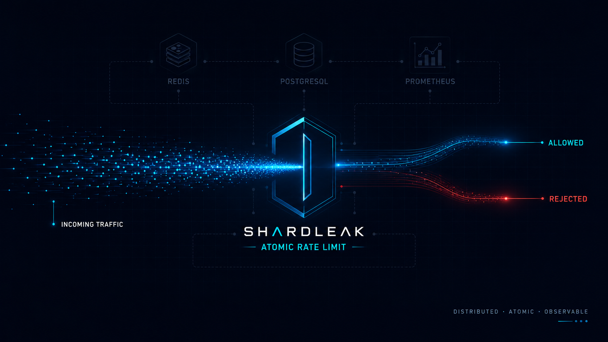
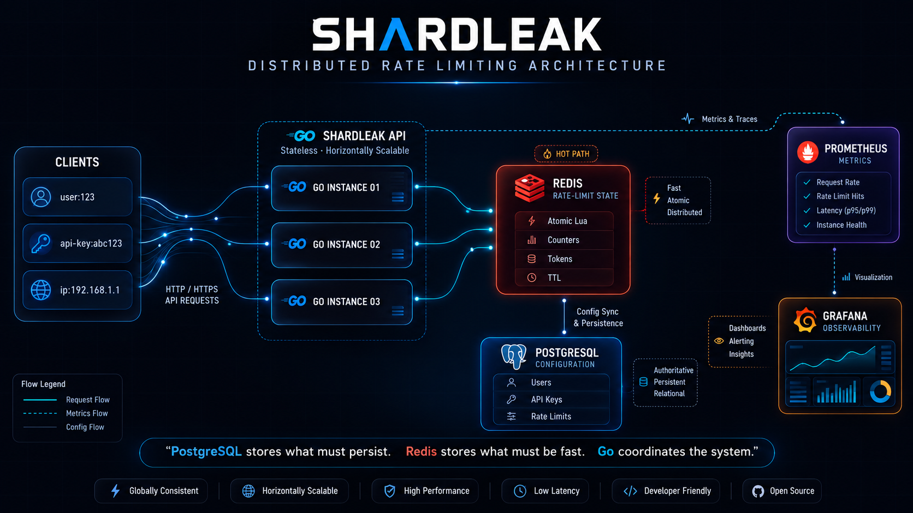
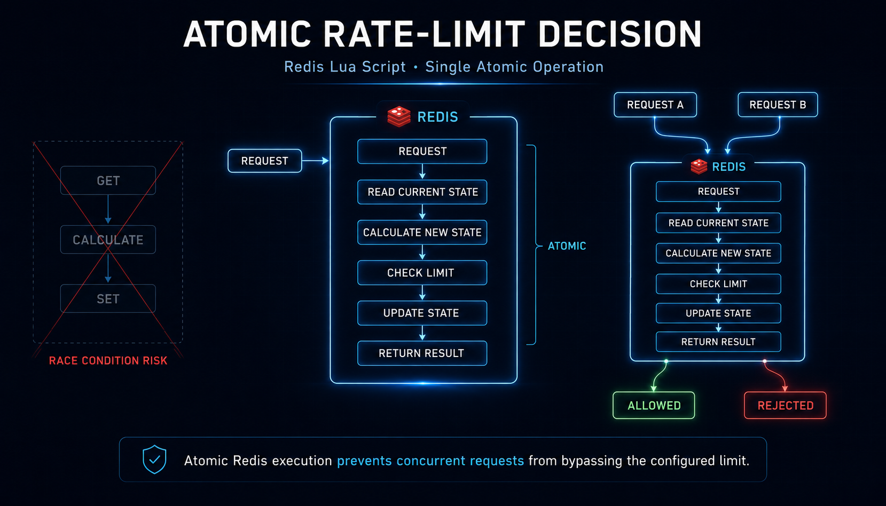
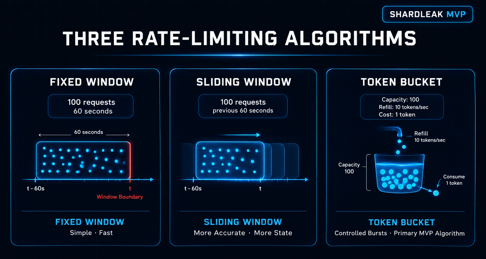

<p align="center">
  
</p>

<h3 align="center">Distributed rate-limiting infrastructure built around stateless Go services and shared Redis state.</h3>

<p align="center">
  
  
  
  
</p>

---

## Why SHARDLEAK?

In-memory rate-limiting breaks at the first horizontal scale event. Once two API instances run, each maintains its own counter — a client that sends requests to both bypasses any per-instance limit.

SHARDLEAK solves this by keeping rate-limit state in Redis, shared across all API instances:

- **Atomic decisions** — every check is a single Redis Lua script; no two goroutines can race and both approve the same request
- **Stateless API** — each Go instance is interchangeable; adding instances does not fragment rate-limit state
- **Persistent configuration** — rate-limit policies live in PostgreSQL, surviving restarts and redeployments
- **Separation of concerns** — Redis owns what must be fast; PostgreSQL owns what must persist
- **Observable by default** — six Prometheus metrics, auto-provisioned Grafana dashboard, standard rate-limit response headers

---

## Contents

- [Architecture](#architecture)
- [Request Flow](#request-flow)
- [Rate-Limiting Algorithms](#rate-limiting-algorithms)
- [Distributed State](#distributed-state)
- [Observability](#observability)
- [Project Structure](#project-structure)
- [Quick Start](#quick-start)
- [API Usage](#api-usage)
- [Configuration](#configuration)
- [Development](#development)
- [Testing](#testing)
- [Design Principles](#design-principles)
- [Roadmap](#roadmap)
- [Contributing](#contributing)
- [License](#license)

---

<p align="center">
  
</p>

## Architecture

<p align="center">
  
</p>

```
Clients
   ↓
ShardLeak Go API  (stateless — multiple instances)
   ├── Redis      ← hot-path rate-limit state, atomic Lua decisions
   └── PostgreSQL ← users, API keys, rate-limit configurations
                     │
               Prometheus ──▶ Grafana
```

| Component  | Responsibility |
|------------|----------------|
| Go API     | HTTP routing, authentication, Redis/PostgreSQL coordination |
| Redis      | Rate-limit counters, token bucket state, atomic Lua execution, TTL-based cleanup |
| PostgreSQL | Persistent users, hashed API keys, rate-limit configurations |
| Prometheus | Metrics collection; scrapes `GET /metrics` every 15 seconds |
| Grafana    | Auto-provisioned dashboard; requests/sec, latency percentiles, error rates |

The API is deliberately stateless. All rate-limit state lives in Redis. Any number of API instances can run simultaneously — they converge on the same Redis state for every identifier.

---

## Request Flow

<p align="center">
  
</p>

Every `POST /api/v1/check` request follows this path:

```
1.  Request arrives at the Go API
2.  API key extracted from Authorization: Bearer header
3.  SHA-256 hash of the key looked up in PostgreSQL — invalid or revoked keys return 401
4.  Redis Lua script executes atomically:
      a. read current bucket / counter state
      b. calculate new state (refill elapsed tokens, increment window counter)
      c. decide ALLOW or REJECT
      d. write new state back
      e. return {allowed, remaining, reset_at, retry_after}
5.  Response returned with X-RateLimit-* headers
```

**Why atomic execution matters.** A naive implementation reads state, calculates a decision, then writes state back as three separate Redis commands. Between the read and the write, a second concurrent request reads the same state and both are allowed. The Lua script serializes the entire read-modify-write into a single Redis operation — no two requests for the same identifier can interleave inside it.

Redis key format:

```
shardleak:rate:tb:{identifier}   ← token bucket (HMSET: tokens, last_ms)
shardleak:rate:fw:{identifier}   ← fixed window (GET/INCR per window_start)
```

---

## Rate-Limiting Algorithms

<p align="center">
  
</p>

| Algorithm    | State model                        | Burst handling           | Window boundary behavior | Status      |
|--------------|------------------------------------|--------------------------|--------------------------|-------------|
| Token Bucket | tokens + last_refill_ms in Redis   | Yes — up to `limit`      | Continuous refill        | Implemented |
| Fixed Window | counter per wall-clock window      | At boundary only         | Resets on window flip    | Implemented |
| Sliding Window | —                                | —                        | —                        | Not implemented |

### Token Bucket (`token_bucket`)

Tokens refill continuously at `limit / window_seconds` tokens per second. Each request consumes one token. Requests are allowed until the bucket is empty, then rejected until enough tokens have accumulated. Supports controlled bursts up to `limit`.

### Fixed Window (`fixed_window`)

A counter increments on each request and resets at the start of each wall-clock window. Simple and predictable. Known tradeoff: a burst of up to `2 × limit` requests can pass at a window boundary (end of window N plus start of window N+1).

Both algorithms execute as a single Redis Lua script. The implementation choice is passed per-request via the `algorithm` field.

---

<p align="center">
  
</p>

## Distributed State

> PostgreSQL stores what must persist. Redis stores what must be fast. Go coordinates the system.

### Redis

Redis holds all hot-path rate-limit state. On every `POST /api/v1/check`, the Lua script reads, updates, and writes state — all within one atomic call. Redis keys carry a TTL so inactive identifiers are cleaned up automatically (token bucket: `window_seconds × 2`; fixed window: `EXPIREAT` set to the window boundary).

If Redis is unavailable, the API returns `503 Service Unavailable`. SHARDLEAK **fails closed** — it never silently allows unlimited traffic when state cannot be read reliably.

### PostgreSQL

PostgreSQL stores the data that must survive a Redis flush or a restart:

- `users` — email, bcrypt password hash
- `api_keys` — SHA-256 key hash, name, revocation timestamp
- `rate_limit_configs` — identifier, algorithm, limit, window_seconds per user

Rate-limit counters are never stored in PostgreSQL. The normal check path does not query PostgreSQL at all after the initial API key validation.

---

## Observability

Prometheus scrapes `GET /metrics` every 15 seconds. All metrics are labeled by `algorithm` where applicable.

| Metric | Type | Description |
|--------|------|-------------|
| `shardleak_requests_total` | Counter | Total rate-limit check requests received |
| `shardleak_allowed_total` | Counter | Decisions that returned ALLOW |
| `shardleak_rejected_total` | Counter | Decisions that returned REJECT |
| `shardleak_request_duration_seconds` | Histogram | End-to-end check latency |
| `shardleak_redis_errors_total` | Counter | Redis errors encountered |
| `shardleak_db_errors_total` | Counter | PostgreSQL errors encountered |

Grafana auto-provisions on startup with a **ShardLeak** dashboard containing seven panels:

| Panel | PromQL |
|-------|--------|
| Requests / sec | `rate(shardleak_requests_total[1m])` |
| Allowed / sec | `rate(shardleak_allowed_total[1m])` |
| Rejected / sec | `rate(shardleak_rejected_total[1m])` |
| P95 Latency | `histogram_quantile(0.95, rate(shardleak_request_duration_seconds_bucket[1m]))` |
| P99 Latency | `histogram_quantile(0.99, rate(shardleak_request_duration_seconds_bucket[1m]))` |
| Redis Errors / min | `increase(shardleak_redis_errors_total[1m])` |
| DB Errors / min | `increase(shardleak_db_errors_total[1m])` |

Dashboard configuration lives in `monitoring/grafana/`. The Prometheus datasource and dashboard provider are auto-provisioned from `monitoring/grafana/provisioning/`.

---

## Project Structure

```text
.
├── backend/
│   ├── cmd/server/            — server entry point (main.go)
│   ├── internal/
│   │   ├── auth/              — bcrypt hashing, JWT issue/validate
│   │   ├── config/            — environment variable loading
│   │   ├── handlers/          — HTTP handlers (auth, check, limits, api-keys)
│   │   ├── metrics/           — Prometheus counter/histogram definitions
│   │   ├── middleware/        — JWT auth, API key auth, CORS, request logging
│   │   ├── postgres/          — PostgreSQL connection pool
│   │   ├── ratelimit/         — Token Bucket and Fixed Window Lua scripts
│   │   ├── redis/             — Redis client
│   │   └── store/             — data access layer (users, keys, configs)
│   ├── migrations/
│   │   └── 001_initial_schema.sql
│   ├── Dockerfile
│   └── go.mod
├── frontend/                  — Next.js dashboard (connects to Go API)
├── frontend-demo/             — Standalone demo (zero backend dependency)
├── monitoring/
│   ├── prometheus.yml         — scrape config targeting api:8080/metrics
│   └── grafana/
│       ├── provisioning/      — datasource and dashboard provider YAML
│       └── dashboards/        — shardleak.json panel definitions
├── tests/
│   └── load/
│       └── rate_limit.js      — k6 load test (standard + concurrency scenarios)
├── .github/workflows/ci.yml   — GitHub Actions CI pipeline
├── .env.example
└── docker-compose.yml
```

---

## Quick Start

Requires Docker and Docker Compose.

```bash
git clone https://github.com/shardleak/shardleak
cd shardleak
docker compose up --build
```

| Service    | URL                     | Notes                       |
|------------|-------------------------|-----------------------------|
| API        | http://localhost:8082   | Go HTTP server              |
| Prometheus | http://localhost:9090   | Metrics                     |
| Grafana    | http://localhost:3000   | `admin` / `admin`           |
| PostgreSQL | localhost:5435          | Internal only               |
| Redis      | localhost:6380          | Internal only               |

The Grafana **ShardLeak** dashboard provisions automatically. Generate traffic from the playground and observe requests/sec, allowed/rejected rates, and latency in real time.

### Running the frontend

The frontend is a Next.js app that connects to the Go API and runs separately from Docker Compose:

```bash
cd frontend
npm install
npm run dev          # http://localhost:3001
```

Set `NEXT_PUBLIC_API_URL=http://localhost:8082` in `frontend/.env.local` to point at the local API.

### Running the API without Docker

```bash
cp .env.example .env
# Edit .env with your PostgreSQL and Redis connection strings
cd backend
go run ./cmd/server
```

### Prerequisites

| Dependency    | Version  | Required for                          |
|---------------|----------|---------------------------------------|
| Docker Engine | 24+      | `docker compose up`                   |
| Docker Compose | v2      | `docker compose up`                   |
| Go            | 1.25     | Local development, tests              |
| Node.js       | 20       | Frontend (`cd frontend && npm run dev`) |
| k6            | any      | Load tests (`tests/load/rate_limit.js`) |

---

## API Usage

The base URL for a local Docker Compose stack is `http://localhost:8082`.

### Authentication

```bash
# Register
curl -X POST http://localhost:8082/api/v1/auth/signup \
  -H "Content-Type: application/json" \
  -d '{"email":"user@example.com","password":"your-password"}'

# Login — returns {"token":"eyJ..."}
curl -X POST http://localhost:8082/api/v1/auth/login \
  -H "Content-Type: application/json" \
  -d '{"email":"user@example.com","password":"your-password"}'

# Current user
curl http://localhost:8082/api/v1/auth/me \
  -H "Authorization: Bearer <jwt>"
```

### Rate-limit check

```bash
curl -X POST http://localhost:8082/api/v1/check \
  -H "Authorization: Bearer sk_shard_..." \
  -H "Content-Type: application/json" \
  -d '{
    "identifier":     "user:123",
    "algorithm":      "token_bucket",
    "limit":          100,
    "window_seconds": 60
  }'
```

**Allowed response (`200 OK`):**

```json
{"allowed":true,"remaining":99,"reset_at":"2026-08-18T12:01:00Z","retry_after":null}
```

**Rejected response (`429 Too Many Requests`):**

```json
{"allowed":false,"remaining":0,"reset_at":"2026-08-18T12:01:00Z","retry_after":42}
```

**Standard headers on every response:**

```
X-RateLimit-Limit:     100
X-RateLimit-Remaining: 99
X-RateLimit-Reset:     1787054460
Retry-After:           42          (rejected requests only)
```

### API keys

The `/check` endpoint uses API keys (`sk_shard_...`), not JWTs. Create keys from a JWT session:

```bash
# Create — plaintext key returned only at creation
curl -X POST http://localhost:8082/api/v1/api-keys \
  -H "Authorization: Bearer <jwt>" \
  -H "Content-Type: application/json" \
  -d '{"name":"production"}'
# → {"id":"...","name":"production","key":"sk_shard_...","created_at":"..."}

# List (metadata only — no key plaintext)
curl http://localhost:8082/api/v1/api-keys \
  -H "Authorization: Bearer <jwt>"

# Revoke
curl -X DELETE http://localhost:8082/api/v1/api-keys/<id> \
  -H "Authorization: Bearer <jwt>"
```

### Rate-limit configuration

Configurations are persisted in PostgreSQL and surfaced in the dashboard playground:

```bash
# Create
curl -X POST http://localhost:8082/api/v1/limits \
  -H "Authorization: Bearer <jwt>" \
  -H "Content-Type: application/json" \
  -d '{"identifier":"user:123","algorithm":"token_bucket","limit":100,"window_seconds":60}'

# List all
curl http://localhost:8082/api/v1/limits \
  -H "Authorization: Bearer <jwt>"

# Get one
curl http://localhost:8082/api/v1/limits/user:123 \
  -H "Authorization: Bearer <jwt>"

# Delete
curl -X DELETE http://localhost:8082/api/v1/limits/user:123 \
  -H "Authorization: Bearer <jwt>"
```

### Health endpoints

```
GET /health    → 200 if the process is alive
GET /ready     → 200 if PostgreSQL and Redis are reachable
GET /metrics   → Prometheus metrics
```

---

## Configuration

| Variable       | Description                          | Required | Default |
|----------------|--------------------------------------|:--------:|---------|
| `PORT`         | HTTP listen port                     | No       | `8080`  |
| `DATABASE_URL` | PostgreSQL connection string         | Yes      | —       |
| `REDIS_URL`    | Redis connection string              | Yes      | —       |
| `JWT_SECRET`   | Signing key for HS256 JWTs           | Yes      | —       |
| `CORS_ORIGIN`  | Allowed CORS origin                  | No       | —       |

Copy `.env.example` for local development:

```bash
cp .env.example .env
```

Never commit `.env` or expose `JWT_SECRET`. Use a randomly generated secret in production (e.g., `openssl rand -hex 32`).

**Production deployment targets:**

| Component  | Platform               |
|------------|------------------------|
| Go API     | Railway (Dockerfile)   |
| PostgreSQL | Railway / Supabase / Neon |
| Redis      | Railway / Upstash      |
| Frontend   | Vercel (zero-config)   |

---

## Development

```bash
cd backend

# Format
gofmt -w .

# Vet
go vet ./...

# Build
go build ./cmd/server

# Run locally (requires .env)
go run ./cmd/server
```

Apply database migrations manually when running outside Docker:

```bash
psql "$DATABASE_URL" -f backend/migrations/001_initial_schema.sql
```

---

## Testing

```bash
cd backend

# Unit + integration tests (integration tests skip if Redis/PostgreSQL are unreachable)
go test ./...

# With race detector
go test -race ./...
```

Integration tests connect to real Redis and PostgreSQL instances using `REDIS_URL` and `DATABASE_URL` from the environment. If those services are unreachable, integration tests skip automatically — they do not fail.

### Concurrency correctness

The most important test fires 1000 goroutines simultaneously against the same identifier with `limit=100`:

```go
// internal/ratelimit/ratelimit_test.go
func TestConcurrency_TokenBucketEnforcesLimit(t *testing.T) {
    // 1000 goroutines, limit=100 — expects exactly 100 allowed
}
func TestConcurrency_FixedWindowEnforcesLimit(t *testing.T) {
    // same for fixed window
}
```

Both tests assert `allowed == 100` exactly. Any higher count indicates the Lua atomicity invariant has been violated.

### Load test

Requires [k6](https://k6.io):

```bash
# Standard load: 100 VUs for 30 seconds across 10 identifiers
k6 run --env API_KEY=sk_shard_... tests/load/rate_limit.js

# Concurrency scenario: 1000 VUs, limit=100 — validates ~100 allowed
k6 run --env API_KEY=sk_shard_... --env SCENARIO=concurrency tests/load/rate_limit.js
```

Create an API key from the dashboard before running the load test.

### CI

GitHub Actions runs on every push and PR to `main`/`master`:

1. `gofmt` — formatting check
2. `go vet` — static analysis
3. `go test ./...` — unit + integration tests against real Redis + PostgreSQL service containers
4. `go test -race ./...` — race detector
5. `docker build` — image build verification
6. `npm ci && npm run build` — frontend build

---

## Design Principles

**1. Stateless API, shared state.** No rate-limit data is kept in the Go process. Multiple instances can run and route requests independently — Redis holds the single source of truth.

**2. Atomic decisions.** Every rate-limit check is a single Lua script execution. The read-modify-write is unbreakable. Concurrency cannot cause two requests to both be approved when one of them should be rejected.

**3. Fast hot path.** The check path hits Redis once and PostgreSQL zero times after initial API key validation. Configs are stored in PostgreSQL but are not queried per check.

**4. Fail closed.** When Redis is unavailable, the API returns `503 Service Unavailable`. Unlimited traffic is never silently allowed.

**5. Separation of concerns.** Redis owns volatile rate-limit state. PostgreSQL owns persistent configuration. Go coordinates the two. Nothing leaks across these boundaries.

**6. Observable by default.** Six Prometheus metrics cover decisions, latency, and error rates. No additional instrumentation is required to understand system behavior.

---

## Roadmap

- [x] Token Bucket algorithm with atomic Lua execution
- [x] Fixed Window algorithm with atomic Lua execution
- [x] JWT-based user authentication
- [x] SHA-256 hashed API key management
- [x] Rate-limit configuration persistence (PostgreSQL)
- [x] Six Prometheus metrics with Grafana auto-provisioning
- [x] Concurrency correctness test (1000 goroutines, limit=100)
- [x] GitHub Actions CI (gofmt, vet, test, race, docker build)
- [x] Next.js dashboard with real-time playground
- [ ] Sliding Window algorithm
- [ ] Production deployment

---

## Contributing

1. Fork the repository
2. Create a feature branch (`git checkout -b feat/sliding-window`)
3. Make changes — keep commits focused on a single logical change
4. Run tests (`cd backend && go test -race ./...`)
5. Run formatting (`gofmt -w .` and `go vet ./...`)
6. Open a pull request against `master`

Do not commit `.env`, secrets, or generated build artifacts. See [`CLAUDE.md`](CLAUDE.md) for the full architecture and development contract.

---

## License

No license file is currently present in this repository. All rights reserved until a license is added.
